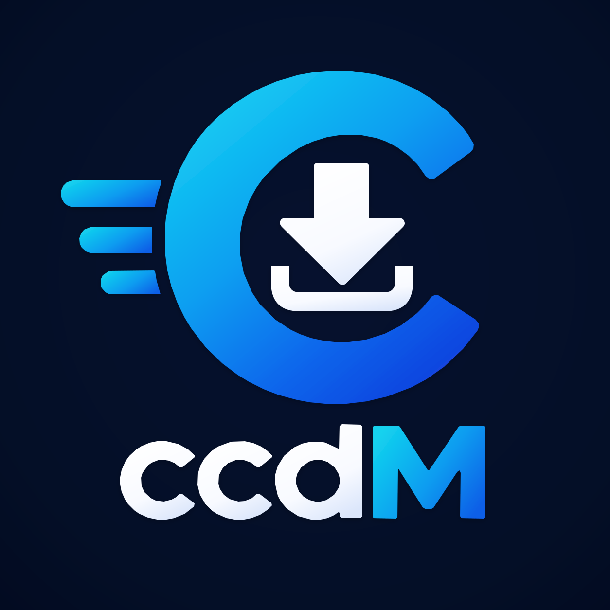

<p align="center">
  
</p>

<h1 align="center">ccdwonloadmanager (ccDM)</h1>

<p align="center">
  A fast, modern download manager for Windows, Linux and macOS.<br>
  Segmented downloads, video capture, browser integration — in Rust.
</p>

<p align="center">
  <a href="https://github.com/merajal746-oss/ccdwonloadmanager/actions"></a>
  <a href="LICENSE"></a>
</p>

---

## Features

**Downloads**
- Multi-connection segmented downloading with resume and stale-part repair
- Global speed limiter, per-download connection control
- HLS (m3u8) and DASH (mpd) streams with best-rendition picking
- YouTube-style video pages via yt-dlp (auto-resolve, quality picker, ffmpeg muxing)
- Clipboard monitoring, download scheduler with weekly windows
- Proxy support, filename sanitizing, category folders

**Apps**
- **Desktop GUI** — live queue with progress bars, per-row speed + ETA,
  pause/resume/retry, folder reveal, MP3 convert, dark/light themes,
  full Settings screen, translated UI
- **Headless CLI** — `probe`, `download`, `add`, `list`, `start`,
  `convert`, `video`, `update-check`, `setup`, `lang`
- **Browser extension** (Chrome/Edge/Firefox) — takes over downloads
  into the queue via a native-messaging host
- Shutdown-on-finish, self-update checks, persistent queue + config

## Getting started

1. Open the repo's **Actions** tab → latest successful run → download
   `ccdm-windows-x86_64` (or the Linux/macOS artifact).
2. Run `ccdm-gpui` for the desktop app, or `ccdm-cli --help` for the terminal.
3. (Optional, for video pages) run `ccdm-cli setup` once, or hit
   **Setup video** in Settings — downloads yt-dlp (+ffmpeg on Windows)
   automatically. Or install [yt-dlp](https://github.com/yt-dlp/yt-dlp)
   and [ffmpeg](https://ffmpeg.org/download.html) yourself.

No Rust toolchain needed — everything is built by CI.

## GUI usage

Run `ccdm-gpui`. Copy a download link anywhere, hit **Add from clipboard**
(probes the URL in the background), then **Start**. **Pause** stops at the
next chunk boundary; **Resume** continues from the `.part` files. The queue
is shared with the CLI, so `ccdm-cli list` sees GUI downloads too.

- Finished rows: **Folder** (reveals the file), **Again** (re-downloads),
  **MP3** (converts via ffmpeg)
- **Organize** sorts new downloads into `Video/`, `Documents/`, … subfolders
- **Speed** and **Connections** apply to newly started downloads
- The gear button opens **Settings**: download folder, speed, connections,
  quality, language, toggles, schedule days + times, video tools, proxy,
  update repo — everything clickable, no config editing required

## CLI usage

```sh
ccdm-cli probe <URL>
ccdm-cli download <URL> [--output out.bin] [--connections 8]
ccdm-cli add <URL> [--name file.zip]
ccdm-cli list
ccdm-cli start [--id ID] [--connections 8] [--force] [--wait] [--shutdown]
ccdm-cli convert <file> [--to mp3|mp4]
ccdm-cli update-check [--repo owner/name]
ccdm-cli lang [--set CODE]
ccdm-cli video <watch-URL> [--output out.mp4] [--quality best|1080p|720p|480p|audio]
ccdm-cli setup   # auto-install yt-dlp (+ffmpeg on Windows), registers it
```

Config lives in `<config-dir>/ccdm/config.json`, the queue in
`<config-dir>/ccdm/queue.json` (Windows: `%APPDATA%\ccdm\...`), language
files in `<config-dir>/ccdm/lang/<code>.json`.

## Browser integration

```sh
ccdm-host install   # writes manifest + registers it (Windows reg)
```

Load `ext/chrome` (or `ext/firefox`) as an unpacked/temporary extension,
put its id into the manifest's `allowed_origins`/`allowed_extensions`
(full steps in `ext/README.md`). New browser downloads are then cancelled
in-browser and queued in ccdM instead — the GUI imports them live, and
`ccdm-cli list` shows them too. Without the host, the browser downloads
normally.

## Logo & icons

`assets/logo.svg` is the single source of truth (Chrome rejects SVG
extension icons, so PNGs are rendered from it):

- **Desktop icon**: CI renders `icon.ico` (16→256px) from the SVG and the
  Windows `ccdm-gpui.exe` embeds it via `build.rs`. No local tools needed.
- **Extension logo**: the `icons` workflow renders `icon16/48/128.png`
  into `ext/chrome/icons` + `ext/firefox/icons` and commits them back
  (bot pushes don't retrigger CI). Right after pushing logo changes, the
  extension briefly misses its PNGs until that commit lands (~2 min).
- Re-render locally any time: `python tools/render_icons.py --svg
  assets/logo.svg --outdir <dir>` (needs Chrome/Edge/Firefox + python3).

## Layout

```text
crates/ccdm-core   engine: downloads, queue, store, media, browser protocol,
                   scheduler, power, convert, update, i18n, video
crates/ccdm-cli    headless manager app
crates/ccdm-gpui   desktop GUI app (GPUI)
crates/ccdm-host   browser native-messaging host
ext/               MV3 bridge extension (chrome + firefox)
assets/            logo.svg + rendered icon.ico
tools/             render_icons.py (SVG → PNG/ICO via headless browser)
.github/workflows  CI: fmt + clippy + test, then release builds per OS
```

## Development

```sh
cargo fmt --all -- --check
cargo clippy --workspace --all-targets -- -D warnings
cargo test --workspace
cargo build --release --workspace
```

Translations live in code (`ccdm-core/src/i18n.rs`, English embedded);
add a language by dropping `<code>.json` into the `lang` folder —
`ccdm-cli lang --set <code>` picks it up.

## Known limitations

DASH multi-audio muxing, SQLite named queues, in-GUI text input beyond
settings fields, per-row connection override, encrypted HLS, live DASH.

## License

**GPL-2.0-only**. See `LICENSE`.
